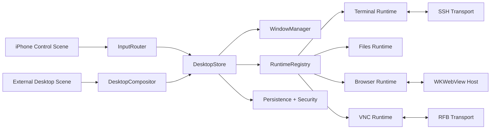

# System Architecture

## Architectural Style

The recommended architecture is `UIKit-first`, modular, scene-based, and state-driven.

The application has two presentation surfaces:

- `Control Scene` on iPhone
- `Desktop Scene` on the external display

Both scenes are thin clients over a shared application core.

## Primary Architectural Decision

The system should use a single shared source of truth for desktop state, while keeping live runtimes out of the view layer.

This leads to two central layers:

- `DesktopStore` for persistent and syncable state
- `RuntimeRegistry` for long-lived live objects such as SSH channels, VNC sessions, and browser hosts

## High-Level Diagram

## Layer Breakdown

### Presentation Layer

Owns scene-specific UI and rendering:

- iPhone control surface
- external display desktop compositor
- panels, overlays, and command menus

The presentation layer must not own authoritative business state.

### Coordination Layer

Owns app behavior:

- `DesktopStore`
- action dispatch
- reducers and validation
- focus and selection rules
- workspace and window orchestration

### Runtime Layer

Owns live session objects:

- terminal buffers
- SSH connections
- VNC streams
- browser instances and snapshots

This layer should remain alive independently of scene recreation whenever system resources allow it.

### Infrastructure Layer

Owns persistence, logging, security, and adapters to external libraries.

## Core Principles

### Scenes Are Replaceable

Any scene can disappear and be rebuilt without losing authoritative state.

### Runtimes Are Durable

Long-running sessions must be attached to stable identifiers and managed outside scene controllers.

### Geometry Is Logical, Not Physical

Window positions and sizes must be stored in normalized desktop coordinates rather than raw pixels.

### Input Is Centralized

Keyboard, pointer, and gesture input must pass through one routing model so focus and shortcuts are predictable.

## Recommended Technology Stack

- UI foundation: `UIKit`
- selective modern UI: `SwiftUI` for settings and low-risk forms only
- concurrency: `Swift Concurrency`, `actors`, `AsyncSequence`
- browser engine: `WKWebView`
- terminal/SSH: `SwiftNIO SSH` plus terminal rendering adapter
- VNC: dedicated RFB adapter layer
- persistence: `SwiftData` or SQLite-backed storage abstraction
- secrets: `Keychain`

## Why Not Pure SwiftUI

Pure SwiftUI is not the recommended foundation for this project because the hardest parts are:

- multi-scene control
- focus and responder behavior
- physical keyboard processing
- pointer routing
- custom desktop windowing
- low-level rendering and performance tuning

SwiftUI can still be used for non-critical screens, but the desktop shell should remain under UIKit control.

