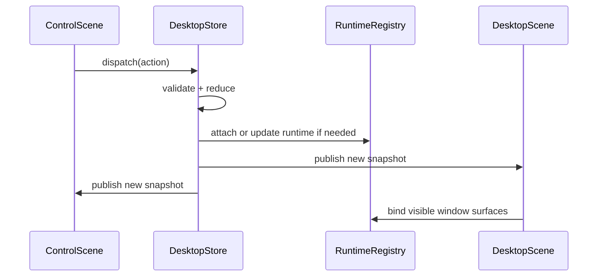

# Scenes and State Sync

## Scene Model

The application uses two scenes:

- `ControlScene` on iPhone
- `DesktopScene` on an external display

Both scenes connect to the same application core.

## Design Rule

Scenes must not synchronize with each other directly. They synchronize through shared core state and runtime ownership.

## Shared Core Components

### `DesktopStore`

Contains synchronized state:

- open windows and window ordering
- workspace definitions
- focused window and focused target
- layout metadata
- display profile
- browser session metadata
- connection descriptors
- shortcut state and UI preferences

### `RuntimeRegistry`

Contains live objects that should not be serialized into the store:

- SSH channels
- terminal buffer engines
- VNC frame streams
- browser hosts and snapshots

Current lifecycle behavior:

- VNC runtimes are paused when the app enters background
- VNC runtimes are resumed on foreground entry
- reconnect attempt state is synchronized through shared snapshot data

## Action Flow

## State Categories

### Persisted State

Should survive app relaunch:

- workspace layout
- window chrome state
- recent connections
- user preferences
- display scaling preferences

### Session State

Should survive scene recreation if possible:

- SSH session objects
- terminal buffers
- VNC session objects
- browser navigation state metadata

### Scene State

May be recreated freely:

- temporary overlays
- gesture progress
- hover highlights
- keyboard help panels

## Browser Special Case

Browser windows need extra care:

- `WKWebView` instances are scene-bound UI objects
- authoritative browser state should be reduced to metadata in `DesktopStore`
- heavy web view hosting should stay in a scene-local host layer
- the control scene should use previews or snapshots, not a mirrored interactive web view

This is the main reason browser support carries higher implementation risk than terminal or VNC.

## Scene Lifecycle Handling

### External Display Connected

1. Create or restore `DesktopScene`
2. Resolve display profile
3. Bind scene renderer to latest desktop snapshot
4. Reattach visible runtime surfaces

### External Display Disconnected

1. Preserve store state
2. Detach scene-specific render resources
3. Keep durable runtimes alive if allowed
4. Move user control back to iPhone-only fallback UI

### App Backgrounded

1. Flush important state to persistence
2. Mark restorable sessions
3. Downgrade rendering work
4. Pause VNC transport work and resume on foreground
5. Handle network limitations conservatively

## Conflict Strategy

There should be no optimistic two-way merge between scenes. The store processes actions serially and publishes one canonical result.

Recommended approach:

- `actor DesktopStore`
- serialized dispatch queue
- monotonic revision numbers on snapshots

## Persistence Strategy

Persist the following at minimum:

- workspace list
- display profile
- logical geometry for each window
- window-to-session associations
- reconnect hints for sessions

Do not persist:

- raw framebuffer data
- UIKit view instances
- large transient caches
